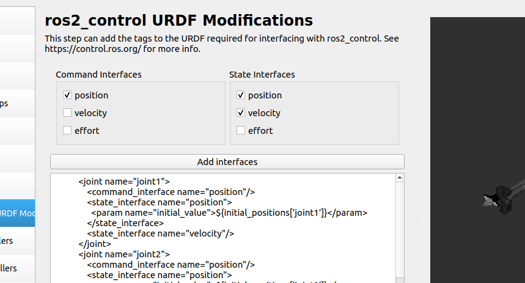

# Topics

## /joint_states

Can publish to this topic to control the robot arm in joint position.
Type:

### sensor_msgs/msg/JointState Message

std_msgs/msg/Header header
string[] name
double[] position
double[] velocity
double[] effort

Example: ros2 topic pub /joint_states sensor_msgs/msg/JointState "{header: {stamp: {sec: 0, nanosec: 0}, frame_id: 'piper_single'}, name: ['joint1', 'joint2','joint3','joint4','joint5','joint6','joint7'], position: [0.2,0.2,-0.2,0.3,-0.2,0.5,0.01], velocity: [0,0,0,0,0,0,10], effort: [0,0,0,0,0,0,0.5]}"

Note: 
in velocity, only last element controls the total speed % of the whole trajector, similar to the SDK
Effort at the end is the amount of effort in Nm for the gripper. Range: [0-5].

## /pos_cmd

### piper_msgs/msg/PosCmd Message

/* meters */
float64 x
float64 y
float64 z

/* radians */
float64 roll
float64 pitch
float64 yaw

/* meters */
float64 gripper

/* invalid */
int32 mode1
int32 mode2

## MoveIt

Not sure what this does and how it affects things

### Errors
I think lack of definitions for the other joints and links like gripper base is why it doesnt work